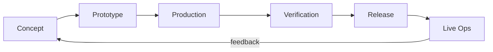

# Game Development Life Cycle (GDLC)

This document outlines how FPV Web (browser‑based FPV drone racing simulator) is built, tested, released, and maintained. Contribute at any phase — jump to the section that fits your interest.

## 1. Overview



Every feature moves from idea to code to live game in a continuous loop.

## 2. Phase‑by‑phase

### Concept
- **What happens**: New ideas start as GitHub issues (using the `feature_request` template) or as RFCs in `docs/rfcs/`. Discussion refines scope, risk, and impact.
- **Tools**: GitHub Issues, markdown.
- **Artifacts**: RFC documents, feature issues.
- **HOW TO PARTICIPATE**: Open a `feature_request` issue or submit a draft RFC as a PR to `docs/rfcs/`. Tag maintainers for review.

### Prototype
- **What happens**: A spike is built on a feature branch to prove the idea works. We use built‑in determinism helpers to quickly test gameplay:
  - `?mockhid=1` – emulates a DJI RC controller.
  - `window.__fpv.step(n)` – advances physics by `n` ticks (1 tick = 1/240 s).
  - `?map=<name>` – forces a specific map (`canyon`, `valley`, `custom:<name>`, `server:<name>`).
  Playable comes before polished; visuals and performance are secondary at this stage.
- **Tools**: Branch on GitHub, Vite dev server (`npm run dev`), browser console.
- **Artifacts**: Working prototype branch, demo recording or shareable URL.
- **HOW TO PARTICIPATE**: Create a branch, implement the spike, use mock HID and step‑through physics to validate, then share for feedback. No strict file structure required.

### Production
- **What happens**: The prototype is hardened into production code. Strict TypeScript is enforced. Rendering uses pooled effects (`render/fx.ts`) and sounds (`audio/sfx.ts`). Physics follows the contract in `CLAUDE.md`:
  - Axes: up/right = positive (consistent across HID, gamepad, keyboard).
  - Race gate orientation: `yawDeg` = average of incoming and outgoing travel directions.
  - Collision: pluggable (flat plane, heightfield, BSP BVH).
  - Sim‑time based (pausing freezes the race timer); physics tick rate 240 Hz.
  Determinism is seeded so that replays and multiplayer remain in sync.
- **Tools**: `vitest` (unit tests), `tsc` (type checking), code review on PRs.
- **Artifacts**: Unit tests in `src/**/__tests__`, typed code, reviewed PRs.
- **HOW TO PARTICIPATE**: Write unit tests with `npm test`, follow the physics contract, submit PRs with clear descriptions. All new features must include tests covering physics contracts and edge cases.

### Verification
- **What happens**: Every PR must pass a quality gate before merge:
  1. `npm run typecheck` – no TypeScript errors.
  2. `npm test` – all unit tests pass (`vitest`).
  3. **Manual flight test** covering:
     - Input methods: keyboard, gamepad, DJI RC, and `?mockhid=1`.
     - Maps: built‑in (`canyon`, `valley`), a custom BSP, and a server map.
  CI (GitHub Actions) runs steps 1 and 2 automatically; manual testing is documented in the PR.
- **Tools**: `tsc --noEmit`, `vitest`, browsers/controllers.
- **Artifacts**: Passing CI status, manual test checklist in PR description.
- **HOW TO PARTICIPATE**: Before opening a PR, run `npm run typecheck` and `npm test` locally. Perform the manual flight matrix and note the results.

### Release
- **What happens**: Merging to `main` triggers CI to build the static assets. Maintainers tag the release (`git tag v1.x.x`) and write release notes. Then they deploy:
  ```bash
  npm run build && rsync -az --delete dist/ arkana-1:/home/arkana/simulator-stack/dist/
  ```
- **Tools**: GitHub Actions (build), `rsync`, `git tag`, GitHub Releases.
- **Artifacts**: Static deployment of `dist/`, GitHub Release with notes.
- **HOW TO PARTICIPATE**: Maintainers handle the final deploy, but anyone can suggest release notes or verify the deployment.

### Live Ops
- **What happens**: Server‑side maps are added by dropping a `.bsp` + `.wad` + `track.json` bundle into `/home/arkana/simulator-stack/maps/<name>/` — no rebuild required. The community contributes maps via `map_submission` issues.
- **Tools**: File server, GitHub Issues.
- **Artifacts**: Playable server maps, best‑lap and feedback issues.
- **HOW TO PARTICIPATE**: Create a map, package it with a `track.json` (exported from the in‑game track editor), and open a `map_submission` issue. Maintainers review and publish if it meets licensing and quality standards.

## 3. Content Pipeline — Maps & Tracks

1. **Community creation**: Design a BSP map (any tool that exports BSP) and original/freely‑redistributable textures (`.wad`).
2. **Local test**: Place the `.bsp` and `.wad` in your browser's domain (load from file or IndexedDB). Use `?map=custom:<name>` to fly it.
3. **Track editor**: In‑game, press `T` to toggle the editor. Place gates with `G`, undo with `U`. The editor automatically calculates `yawDeg` from the travel direction.
4. **Export**: Save the track (auto‑generates `track.json`).
5. **Submit**: Open a `map_submission` issue with the `.bsp`, `.wad`, and `track.json` attached (or link to a downloadable archive).
6. **Publish**: A maintainer verifies that all files are freely redistributable and original, then drops them into the maps directory on the server. The map becomes accessible via `?map=server:<name>`.

**Licensing**: Only files you own or that carry a licence allowing free redistribution (e.g., CC0, MIT for assets) are accepted. No copyrighted game rips.

## 4. Tooling Reference

| Tool / Command | Description |
|---|---|
| `npm run dev` | Start Vite dev server with hot reload. |
| `npm test` | Run all unit tests with Vitest. |
| `npx tsc --noEmit` | Type‑check without emitting output. |
| `?mockhid=1` | URL parameter to emulate a DJI RC (virtual sticks). |
| `window.__fpv.step(n)` | Execute `n` physics ticks (useful for scripting). |
| `?map=<name>` | Force a map: `canyon`, `valley`, `custom:<name>`, or `server:<name>`. |
| Track editor `T`/`G`/`U` | Toggle editor / add gate / undo gate. |
| CI (GitHub Actions) | Runs on every PR: typecheck → test → build. |
| Deploy | `npm run build && rsync -az --delete dist/ arkana-1:/home/arkana/simulator-stack/dist/` |

## 5. Roadmap

- ✅ **Shipped** – Input calibration, racing, BSP map support, in‑game track editor, shooting mechanic.
- 🔜 **Multiplayer Drone Combat** – CS‑style deterministic fixed‑tick netcode, abstracted inputs, hitscan ready (networking layer in progress).
- 🔙 **Backlog** – Spectator & replay, leaderboards, additional weapons, improved collision feedback.

## 6. Contributing

Please read [CONTRIBUTING.md](../CONTRIBUTING.md) for coding style, commit conventions, and the pull request process. All contributions must align with the lifecycle described here.
